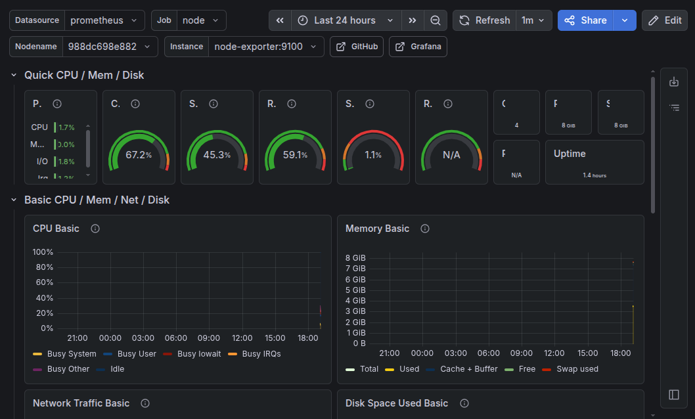
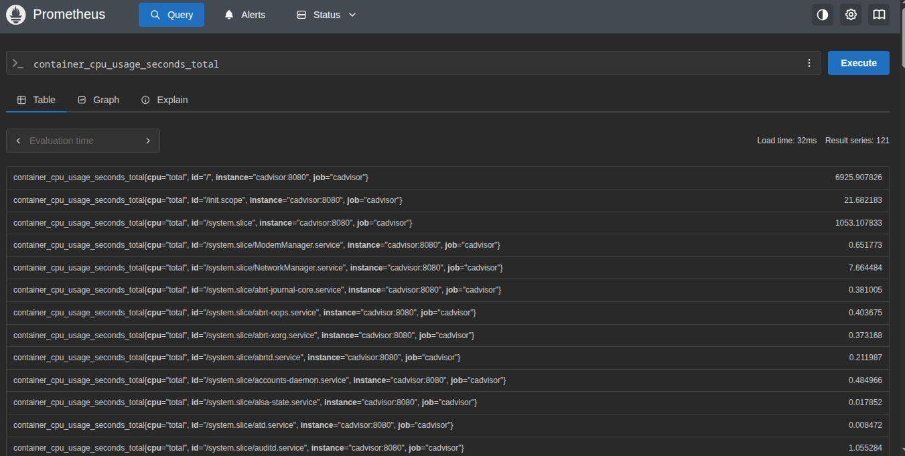
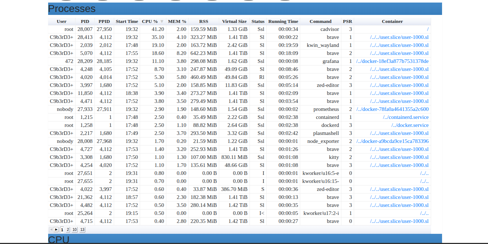
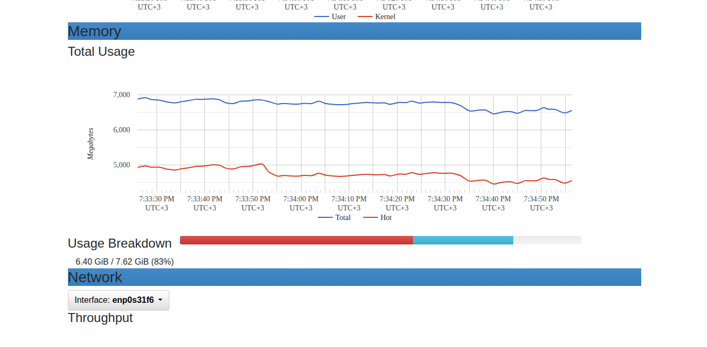
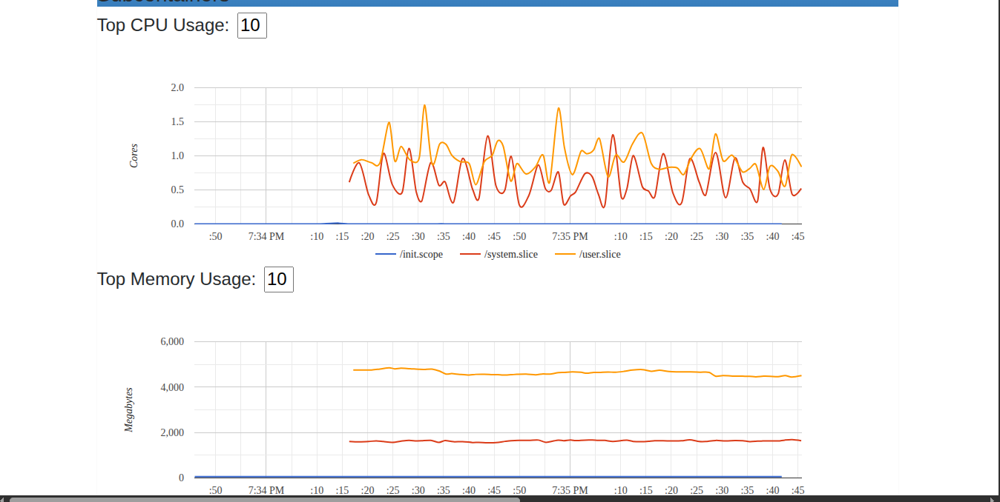

# InfraForge
Enterprise-style infrastructure homelab built using Docker, Nginx, monitoring tools, database and automation scripts

## Overview

InfraForge is a personal infrastructure engineering lab designed to simulate real-world operational environments.

The project focuses on:
- Monitoring
- Container orchestration
- Reverse proxying
- Service reliability
- Infrastructure automation
- Security hardening
- Backup management
- Operational troubleshooting

Built primarily on:
- Fedora Linux
- Docker
- Grafana
- Prometheus
- Nginx
- PostgreSQL
- Redis

## Features

- Dockerized infrastructure stack
- Reverse proxy with Nginx
- Real-time monitoring with Grafana + Prometheus
- Uptime monitoring with Uptime Kuma
- PostgreSQL database deployment
- Redis caching service
- Infrastructure health checks
- Automated backup scripts
- Log monitoring
- Secure internal networking
- Service isolation using Docker networks

## Infrastructure Architecture

Users
   ↓
Nginx Reverse Proxy
   ↓
------------------------------------------------
| Grafana | Uptime Kuma | Adminer | APIs |
------------------------------------------------
   ↓
------------------------------------------------
| PostgreSQL | Redis | Monitoring Services |
------------------------------------------------

## Planned Improvements

- CI/CD integration
- Centralized logging
- Alerting system
- Docker Swarm/Kubernetes exploration
- Infrastructure-as-Code
- SSL automation
- VPN access

## Grafana
Grafana is used for visualizing metrics from Prometheus.

## Prometheus
Prometheus is used for collecting and storing metrics.

## cAdvisor
cAdvisor is used for monitoring container resources.

## Uptime Kuma
Uptime Kuma is used for monitoring the uptime of the infrastructure.
